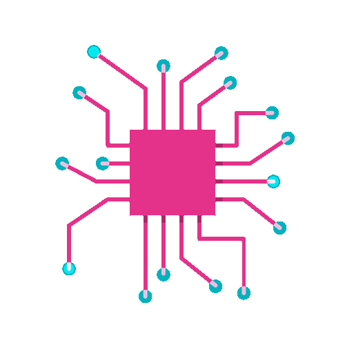

<!-- README.md for GitHub profile -->

# Hey! Nice to see you.

Hi 
## I'm Ahmed 😀

_I'm a learning AI & ML Engineer.
I am also exploring MLOps and Generative AI to build scalable, real-world AI solutions and continuously grow as an AI professional.

*   🌍  I'm based in Bangladesh
*   🖥️  See my portfolio at [https://github.com/Ahmed2797/](https://github.com/Ahmed2797)
*   Linkedin [http://www.linkedin.com/in/tanvir-ahmed-9a776a361/](http://www.linkedin.com/in/tanvir-ahmed-9a776a361/)
*   ✉️  You can contact me at [tanvirahmed754575@gmail.com](mailto:tanvirahmed754575@gmail.com)
*   🧠  I'm currently learning I have some experience and interest in: Deep Learning | Machine Learning | Computer vision | Natural Language Processing | MLOps | Generative AI
*   👥  I'm looking to collaborate on Deep learning, Computer Vision,GenAI

---

### I have some experience and interest in:
- Deep Learning
- Machine Learning
- Computer vision
- Natural Language Processing
- MLOps
- Generative AI

---

  

### Languages and Tools:

  
  
  
  
  
  
  
  
  
  

### Socials
                

 <a href="https://www.github.com/Ahmed2797" target="_blank" rel="noreferrer"> <picture> <source media="(prefers-color-scheme: dark)" srcset="https://raw.githubusercontent.com/danielcranney/readme-generator/main/public/icons/socials/github-dark.svg" /> <source media="(prefers-color-scheme: light)" srcset="https://raw.githubusercontent.com/danielcranney/readme-generator/main/public/icons/socials/github.svg" />  </picture> </a> <a href="https://www.linkedin.com/in/tanvir-ahmed-9a776a361/" target="_blank" rel="noreferrer"> <picture> <source media="(prefers-color-scheme: dark)" srcset="https://raw.githubusercontent.com/danielcranney/readme-generator/main/public/icons/socials/linkedin-dark.svg" /> <source media="(prefers-color-scheme: light)" srcset="https://raw.githubusercontent.com/danielcranney/readme-generator/main/public/icons/socials/linkedin.svg" />  </picture> </a> <a href="https://www.facebook.com/tanvir.ahmed.36928" target="_blank" rel="noreferrer"> <picture> <source media="(prefers-color-scheme: dark)" srcset="https://raw.githubusercontent.com/danielcranney/readme-generator/main/public/icons/socials/facebook-dark.svg" /> <source media="(prefers-color-scheme: light)" srcset="https://raw.githubusercontent.com/danielcranney/readme-generator/main/public/icons/socials/facebook.svg" />  </picture> </a>
 

### My Hobbies and Dreams:
- Traveling
- Coding
- A Good Learner

---

### You can also find me on:

---

> Made with ❤️

   
